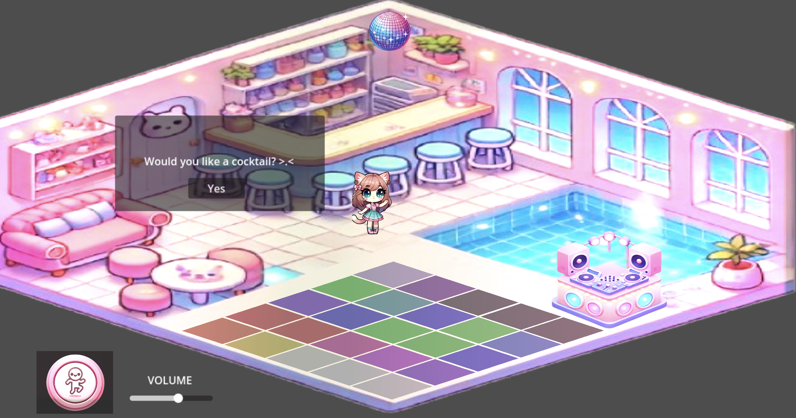
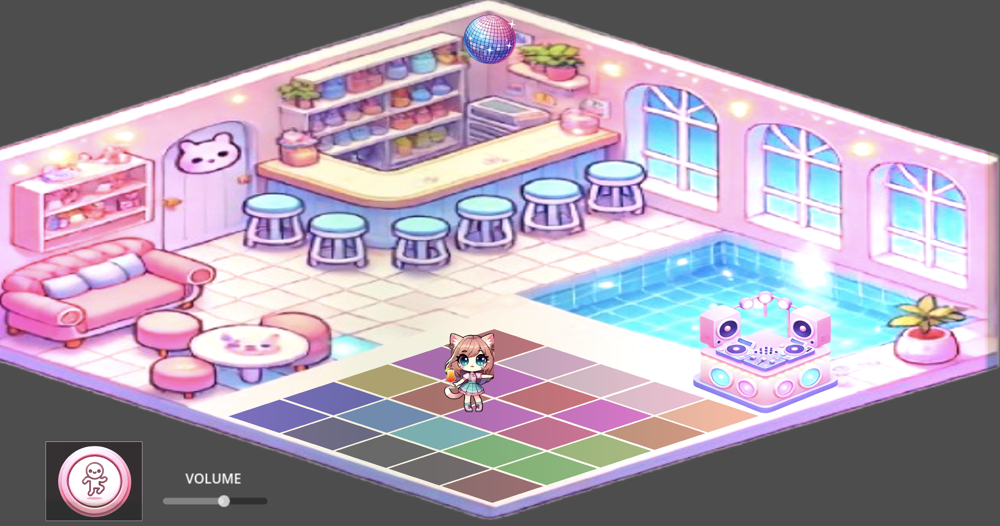
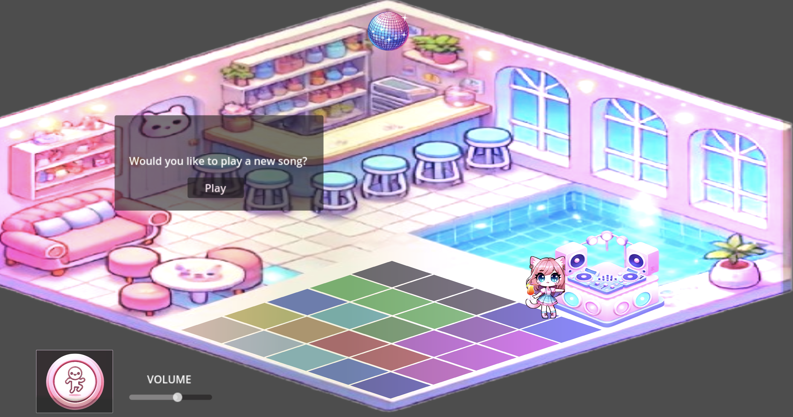

## **🎵 2D Interactive Disco Game 🎮**

Welcome to the **2D Interactive Disco Game** – a fun, cute, and interactive game where player can explore a cute and lively disco-themed environment with animated lights, music, dancing characters, and interactive DJ booths! 🕺✨

### **This is my Youtube Demo Link**
https://www.youtube.com/watch?v=RIRR1pLlPgY&ab_channel=ParisLe
---

### **📌 About the Project**
This is a **2D game** built using **Godot Engine 4.3**, featuring:
- A **dancing character** with animations.
- A colorful **tile-based disco floor** that glows and reacts.
- Dynamic, flashing **ambience lights** that enhance the atmosphere.
- Interactive areas like a **DJ Booth** and **Bar**, where players can trigger pop-ups and actions.
- Custom **volume controls** to manage the background music.

The project is designed to showcase Godot's **2D capabilities**, lighting effects, and interactivity.

---

### **🎮 Features**
1. **Interactive Disco Environment**:
   - A glowing, colorful tile-based dance floor that cycles through soft pink, blue, and purple tones.
   - Swinging disco ball that spins and reflects dynamic light.

2. **Animated Dancing Character**:
   - A character with multiple dancing animations.
   - Pop-up interactions that let the player trigger new actions like holding a drink.

3. **Interactive DJ Booth**:
   - When the player approaches the DJ Booth, a pop-up appears to **play new songs** from a playlist.

4. **Dynamic Lighting**:
   - Randomly flashing **ambience lights** with pastel colors for a cozy vibe.

5. **Volume Controls**:
   - Buttons allow users to **increase or decrease the volume** of the music.

6. **Pop-up Panels**:
   - UI interactions with custom buttons for actions like “Get a Drink” or “Play Music.”

---

### **🛠️ Technologies Used**
- **Godot Engine 4.3**: Game development engine.
- **GDScript**: Scripting language for functionality.
- **2D Assets**: Custom sprites for characters, DJ Booths, and environments.
- **Audio**: Background music and interactive playlist functionality.

### **🚀 How to Run the Game**
1. **Install Godot Engine**:
   - Download the latest version of [Godot Engine 4.3](https://godotengine.org/download).

2. **Clone the Repository**:
   - Run the following command:
     ```bash
     git clone https://github.com/pariseclipse/Audio_Interactive2DGame.git
     ```
   - Open the project folder in Godot.

3. **Run the Project**:
   - Open **Main.tscn** in Godot.
   - Click the **Play** button to launch the game.

---

### **🎮 Controls**
- **Arrow Keys**: Move the character.
- **"Dance" Button**: Makes the character perform a dance animation.
- **"Yes" Button at the Bar**: Character holds a drink.
- **Volume Buttons**: To increase and decrease music volume.
- **DJ Booth**: Trigger a pop-up to play a new song.
- 
---

### **🎨 Assets**
All art used in this project are either custom-made or royalty-free.
The music used in this project is sourced from YouTube and may be subject to copyright.

---

### **📸 Screenshots**

1. **Character Interaction with Bar**:
   
   
   
3. **Vibrant Disco Floor with Lights**:
   
   

5. **Interactive DJ Booth**:
   
   

---

## **🚧 Challenges Encountered**

While building this project, several challenges were faced, each providing me many valuable learning opportunities:

1. **Managing Layering Issues**  
   - Initially, the player character and interactive objects (e.g., the DJ booth) would appear **under the floor or behind other assets**.  
   - This was resolved by carefully organizing the **Z-index** of nodes and using Godot’s **Y-Sort** property to ensure proper layering based on position.

2. **Dynamic Lighting Effects**  
   - Creating realistic **flashing lights** in a 2D environment required trial and error with **PointLight2D** nodes.  
   - To achieve the desired effect of smooth, randomized flashing lights, a script-based solution was implemented, replacing the manual keyframing approach.

3. **Audio Management**  
   - Adding a **volume control slider** and enabling a **playlist of songs** presented difficulties in maintaining proper paths and handling user inputs.  
   - The issues were resolved by debugging the `AudioStreamPlayer2D` references and ensuring audio tracks were dynamically loaded using a playlist array.

4. **Pop-Up Interaction Logic**  
   - Implementing pop-up messages when the player approached specific areas, such as the **bar** or **DJ booth**, required careful setup of **CollisionShape2D** nodes and triggers.  
   - Initially, the pop-ups failed to appear due to incorrect node paths or missing connections, which were fixed with proper signal handling.

5. **Scaling the Game to Fit the Screen**  
   - The assets appeared **too small** compared to the screen size when the project was first run.  
   - This was fixed by adjusting the **Camera2D zoom** settings to ensure the game content filled the viewport proportionally.
   
---

### **🛠 Solutions Learned**
- **Debugging Paths**: Always verify node paths and connections when working with signals or script references.
- **Lighting and Effects**: Balance visual effects like lights to prevent them from being too bright or overwhelming.
- **Scaling**: Proper use of `Camera2D` zoom ensures consistent scaling across devices and resolutions.
- **Audio Handling**: Using `linear_to_db()` and playlists helped in managing dynamic audio transitions smoothly.

---

### **🔧 Future Improvements**
- Add more animations and dances for the character.
- Integrate multiple lighting patterns for the disco ball.
- Expand the playlist feature to support user uploads.
